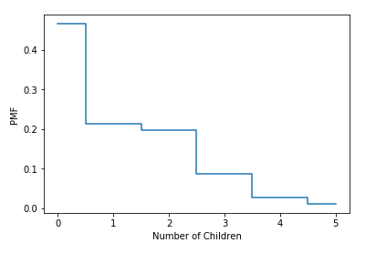
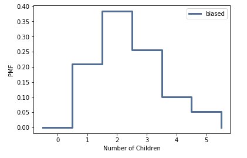

[Think Stats Chapter 3 Exercise 1](http://greenteapress.com/thinkstats2/html/thinkstats2004.html#toc31) (actual vs. biased)

#### Code for unbiased pmf/plot
```python
import matplotlib.pyplot as plt

pmf_numkdhh = resp['numkdhh'].value_counts().sort_index() / len(resp['numkdhh'])
plt.step(pmf_numkdhh.index, pmf_numkdhh.values,where='mid')
plt.xlabel("Number of Children")
plt.ylabel("PMF")
```


```python
#using thinkstats2 package:
pmf = thinkstats2.Pmf(resp.numkdhh,label='numkdhh')
pmf.Mean()
```
1.024

#### Code for biased pmf/plot(used his thinkstats2 module because had trouble doing using pandas. 

```python
biased = BiasPmf(pmf, label='biased')
thinkplot.Pmf(biased)
thinkplot.Config(xlabel="Number of Children", ylabel="pmf")
```

```python
biased.Mean()
```
2.404
